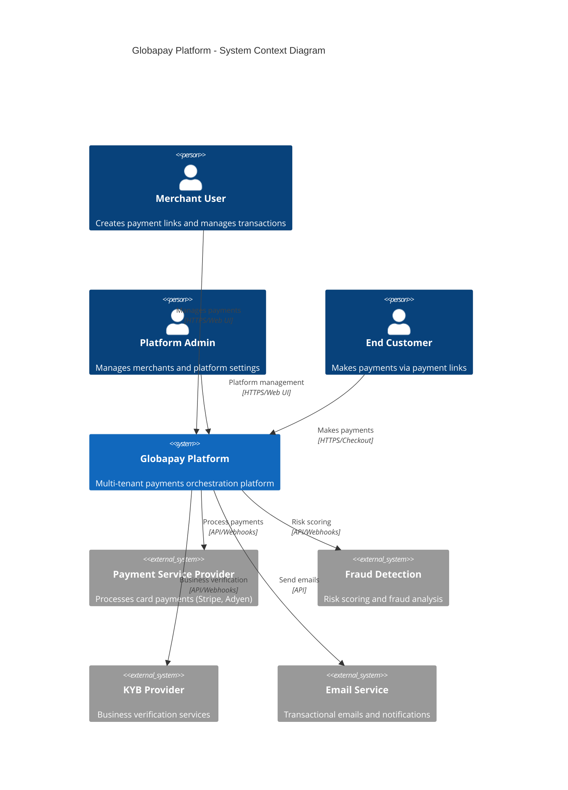
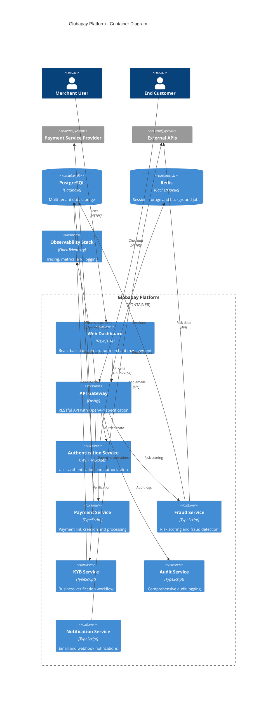
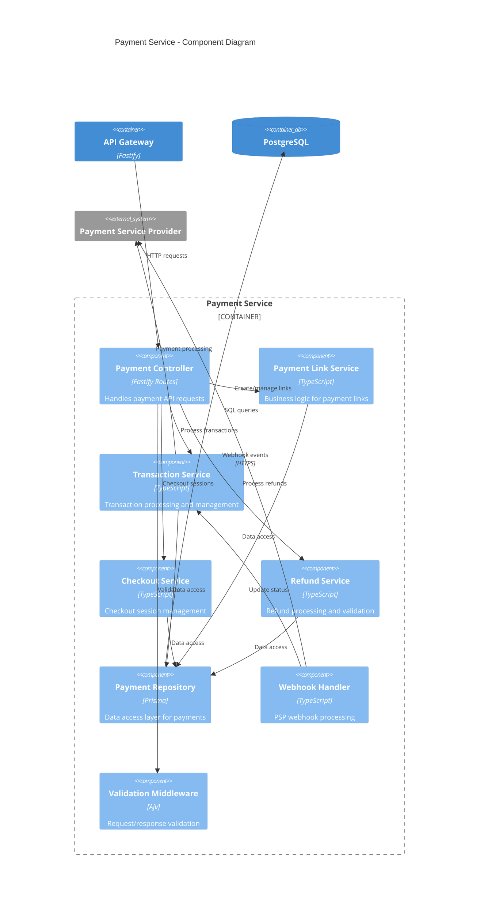
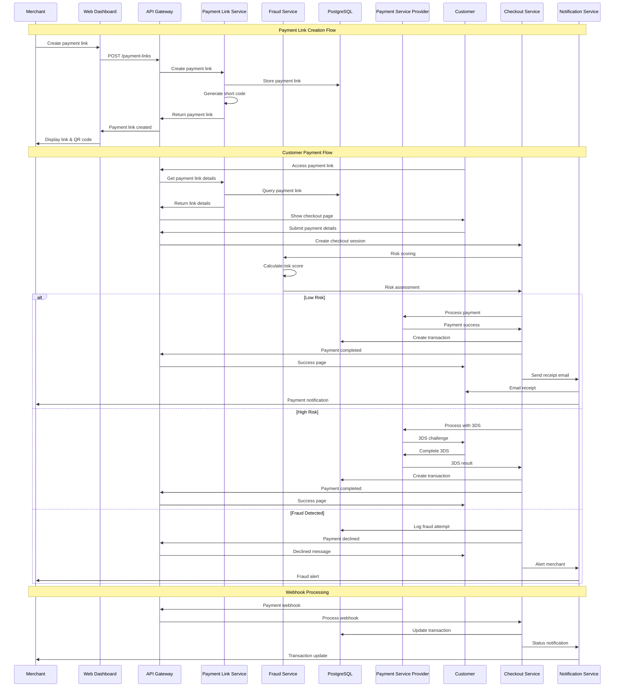
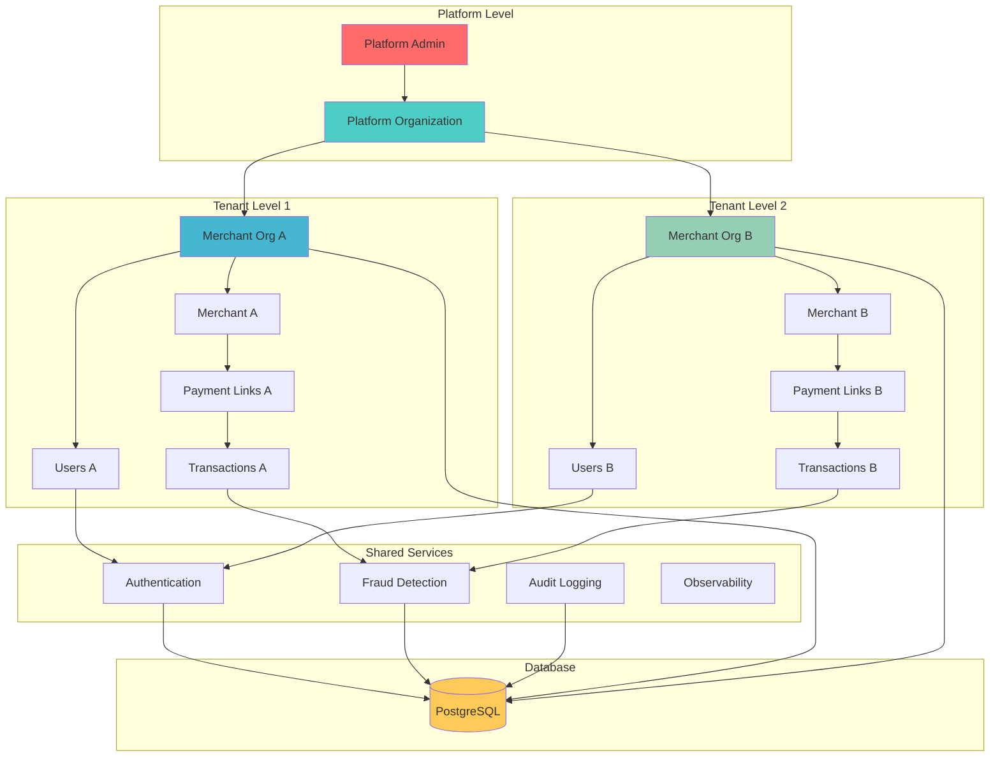

# Globapay Platform Architecture

## System Overview

The Globapay Platform is a contract-first, multi-tenant payments orchestration platform built with TypeScript, supporting both single-merchant and platform tenants with sub-merchants.

## C4 Architecture Diagrams

### Level 1: System Context

### Level 2: Container Diagram

### Level 3: Component Diagram - Payment Service

## Payment Link Flow - Sequence Diagram

## Multi-Tenant Architecture

## Technology Stack

### Backend
- **Framework:** Fastify (Node.js)
- **Language:** TypeScript
- **Database:** PostgreSQL with Prisma ORM
- **Cache:** Redis
- **Authentication:** JWT + NextAuth
- **API:** OpenAPI 3.1 specification

### Frontend
- **Framework:** Next.js 14 (App Router)
- **UI Library:** Tailwind CSS + shadcn/ui
- **State Management:** React Server Components
- **Authentication:** NextAuth.js

### Infrastructure
- **Containerization:** Docker
- **CI/CD:** GitHub Actions
- **Monitoring:** OpenTelemetry + Jaeger + Prometheus
- **Package Management:** pnpm workspaces + Turbo

### External Integrations
- **Payment Processing:** PSP APIs (Stripe, Adyen)
- **Fraud Detection:** Third-party risk scoring
- **KYB Verification:** Document verification services
- **Email Services:** Transactional email providers

## Security Architecture

### Authentication Layers
1. **User Authentication:** JWT tokens (15-minute access + refresh)
2. **API Authentication:** Organization-scoped API keys
3. **Service Authentication:** Internal service-to-service calls
4. **MFA Support:** TOTP for enhanced security

### Data Protection
- **Tenant Isolation:** Row-level security with organization scoping
- **Encryption at Rest:** Database encryption
- **Encryption in Transit:** TLS 1.3 for all communications
- **PCI Compliance:** No card data storage (tokenization via PSP)

### Audit & Compliance
- **Comprehensive Logging:** All security-sensitive operations
- **Request Tracing:** Correlation IDs across all services
- **Audit Trail:** Immutable logs with retention policies
- **GDPR Compliance:** Data subject rights and privacy controls

## Scalability Considerations

### Horizontal Scaling
- **Stateless Services:** All services designed for horizontal scaling
- **Database Sharding:** Partition by tenant for large-scale deployment
- **Caching Strategy:** Redis for session storage and query caching
- **CDN Integration:** Static assets and checkout pages

### Performance Optimization
- **Database Indexing:** Optimized queries with proper indexes
- **Connection Pooling:** Efficient database connection management
- **Background Processing:** Async jobs for non-critical operations
- **API Rate Limiting:** Prevent abuse and ensure fair usage

### Monitoring & Observability
- **Distributed Tracing:** End-to-end request tracking
- **Business Metrics:** Payment success rates, fraud detection rates
- **Performance Metrics:** Response times, error rates, throughput
- **Alerting:** Proactive monitoring with intelligent alerts

This architecture provides a robust, scalable foundation for the Globapay Platform while maintaining security, compliance, and operational excellence.