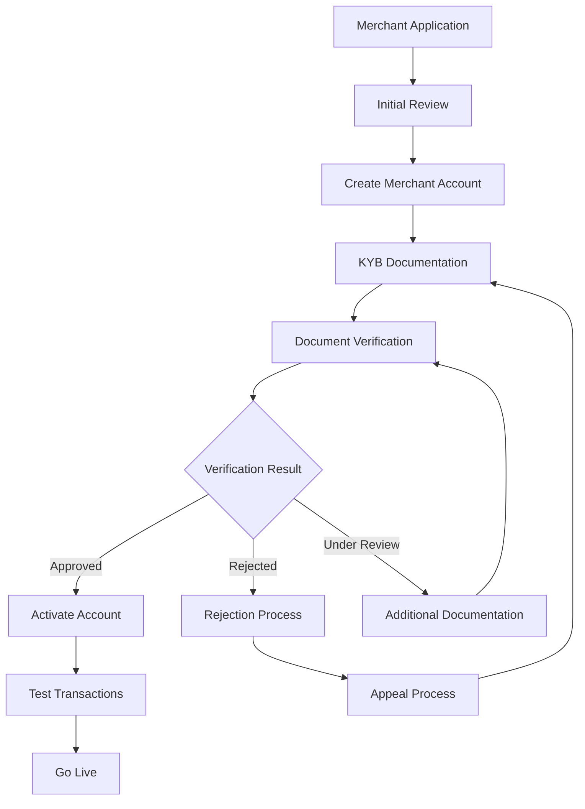

# Runbook: Onboard Merchant

## Overview

This runbook covers the complete merchant onboarding process in the Globapay Platform, from initial application through KYB verification to live payment processing.

## Prerequisites

- Platform Admin access to Globapay Platform
- Access to KYB verification provider dashboard
- Email access for merchant communication
- Knowledge of compliance requirements

## Process Flow



## Step 1: Initial Application Review

### Merchant Information Required
- **Business Details**
  - Legal business name
  - DBA (Doing Business As) name
  - Business type (corporation, LLC, partnership, etc.)
  - Industry/MCC code
  - Business description
  
- **Contact Information**
  - Primary contact name and title
  - Business address
  - Phone number
  - Email address
  
- **Financial Information**
  - Expected monthly volume
  - Average transaction amount
  - Business bank account details

### API Endpoints
```bash
# Create merchant organization
POST /organizations
{
  "name": "Acme Healthcare Ltd",
  "type": "merchant",
  "settings": {
    "industry": "healthcare",
    "mccCode": "8011",
    "expectedVolume": 500000
  }
}

# Create merchant admin user
POST /users
{
  "email": "admin@acmehealthcare.com",
  "name": "John Smith",
  "role": "merchant_admin",
  "organizationId": "{merchant-org-id}"
}
```

### Verification Steps
1. **Business Registration Check**: Verify business is legally registered
2. **Industry Risk Assessment**: Evaluate industry risk level
3. **Volume Analysis**: Assess expected transaction volumes
4. **Initial Screening**: Check against sanctioned lists

## Step 2: Create Merchant Account

### Platform Admin Actions
1. **Login to Platform**
   ```bash
   # Access admin dashboard
   https://dashboard.globapay.com/admin
   ```

2. **Navigate to Merchant Management**
   - Go to **Organizations > Merchants**
   - Click **Add New Merchant**

3. **Complete Merchant Profile**
   ```json
   {
     "organizationDetails": {
       "legalName": "Acme Healthcare Ltd",
       "dbaName": "Acme Clinic",
       "businessType": "limited_company",
       "industry": "healthcare",
       "mccCode": "8011"
     },
     "contactDetails": {
       "primaryContact": "John Smith",
       "email": "admin@acmehealthcare.com",
       "phone": "+1-555-0123",
       "address": {
         "street": "123 Healthcare St",
         "city": "San Francisco",
         "state": "CA",
         "zip": "94105",
         "country": "US"
       }
     },
     "businessProfile": {
       "description": "Primary healthcare clinic",
       "website": "https://acmehealthcare.com",
       "expectedVolume": 500000,
       "averageTicket": 250
     }
   }
   ```

4. **Generate API Credentials**
   ```bash
   # Generate API key for merchant
   POST /api-keys
   {
     "organizationId": "{merchant-org-id}",
     "name": "Production API Key",
     "permissions": ["read", "write", "process_payments"]
   }
   
   # Response includes:
   {
     "keyId": "ak_1234567890",
     "key": "gp_live_sk_1234567890abcdef",
     "permissions": ["read", "write", "process_payments"]
   }
   ```

## Step 3: KYB Documentation Collection

### Required Documents

#### Business Documents
- [ ] **Certificate of Incorporation**
- [ ] **Business Registration Certificate**
- [ ] **Tax Identification Number (EIN/TIN)**
- [ ] **Operating Agreement/Bylaws**
- [ ] **Bank Statements** (last 3 months)

#### Principal/Owner Documents
- [ ] **Government-issued ID** (driver's license/passport)
- [ ] **Proof of Address** (utility bill/bank statement)
- [ ] **SSN/Social Security Card**

#### Additional Documents (if applicable)
- [ ] **Professional Licenses** (medical, legal, etc.)
- [ ] **Processing Statements** (if switching from another processor)
- [ ] **Website Screenshots** or marketing materials

### Document Submission Process

#### API Method
```bash
# Submit KYB documents
POST /merchants/{merchantId}/kyb/submit
{
  "documents": [
    {
      "type": "certificate_of_incorporation",
      "fileName": "certificate.pdf",
      "fileData": "base64_encoded_document",
      "uploadDate": "2024-01-15T10:00:00Z"
    },
    {
      "type": "bank_statement",
      "fileName": "bank_statement.pdf", 
      "fileData": "base64_encoded_document",
      "uploadDate": "2024-01-15T10:05:00Z"
    }
  ],
  "principalInfo": {
    "name": "John Smith",
    "title": "CEO",
    "ssn": "XXX-XX-1234",
    "dateOfBirth": "1980-05-15",
    "address": {
      "street": "456 Executive Ave",
      "city": "San Francisco", 
      "state": "CA",
      "zip": "94105"
    }
  }
}
```

#### Web Dashboard Method
1. **Navigate to KYB Section**
   - Login as Merchant Admin
   - Go to **Settings > Verification**
   - Click **Upload Documents**

2. **Upload Documents**
   - Drag and drop files or click to browse
   - Verify document quality and legibility
   - Add document descriptions/notes
   - Submit for review

### Document Quality Requirements
- **File Formats**: PDF, JPG, PNG
- **Resolution**: Minimum 300 DPI
- **File Size**: Maximum 10MB per file
- **Legibility**: All text must be clearly readable
- **Completeness**: All pages of multi-page documents required

## Step 4: KYB Verification Process

### Automated Checks
```bash
# Check KYB status
GET /merchants/{merchantId}/kyb/status

# Response
{
  "status": "under_review",
  "submissionDate": "2024-01-15T10:00:00Z",
  "lastUpdate": "2024-01-16T14:30:00Z",
  "checks": {
    "businessRegistration": "passed",
    "principalIdentity": "under_review", 
    "bankVerification": "passed",
    "sanctionsScreening": "passed"
  },
  "requiredActions": [
    "Additional ID verification required for principal"
  ]
}
```

### Manual Review Process
1. **Document Review**
   - Verify document authenticity
   - Cross-reference business information
   - Check principal identity documents

2. **Risk Assessment**
   - Industry risk evaluation
   - Geographic risk assessment
   - Volume/velocity analysis
   - Sanctions/watchlist screening

3. **Decision Making**
   - **Approved**: Move to account activation
   - **Rejected**: Provide rejection reasons
   - **Conditional**: Request additional documentation

### KYB Status Updates
```bash
# Update KYB status (Platform Admin)
POST /merchants/{merchantId}/kyb/update-status
{
  "status": "approved",
  "reviewedBy": "admin@globapay.com",
  "notes": "All documents verified successfully",
  "conditions": [],
  "reviewDate": "2024-01-17T09:00:00Z"
}
```

## Step 5: Account Activation

### Pre-Activation Checklist
- [ ] KYB verification completed
- [ ] Risk assessment approved
- [ ] Merchant agreement signed
- [ ] Processing fees configured
- [ ] Banking details verified
- [ ] Integration requirements reviewed

### Activation Process
```bash
# Activate merchant account
POST /merchants/{merchantId}/activate
{
  "activationType": "full",
  "processingLimits": {
    "dailyLimit": 50000,
    "monthlyLimit": 500000,
    "transactionLimit": 5000
  },
  "features": [
    "payment_links",
    "recurring_billing", 
    "refunds",
    "webhooks"
  ]
}
```

### Welcome Communication
1. **Send Welcome Email**
   ```bash
   POST /notifications/send
   {
     "type": "merchant_welcome",
     "recipientId": "{merchant-admin-user-id}",
     "templateData": {
       "merchantName": "Acme Healthcare",
       "dashboardUrl": "https://dashboard.globapay.com",
       "apiKeyId": "ak_1234567890",
       "supportEmail": "support@globapay.com"
     }
   }
   ```

2. **Include in Welcome Package**
   - Login credentials
   - API documentation links
   - Integration guides
   - Support contact information
   - Processing agreement

## Step 6: Testing & Go-Live

### Test Transaction Setup
```bash
# Create test payment link
POST /payment-links
{
  "amount": 100,
  "currency": "USD",
  "description": "Test Transaction - Do Not Fulfill",
  "testMode": true,
  "customerEmail": "test@acmehealthcare.com"
}
```

### Integration Testing
1. **API Integration**
   - Test authentication
   - Create payment links
   - Process test transactions
   - Verify webhooks

2. **Webhook Testing**
   ```bash
   # Test webhook endpoint
   POST /webhooks/test
   {
     "url": "https://acmehealthcare.com/webhooks/globapay",
     "eventTypes": ["payment.completed", "payment.failed"]
   }
   ```

### Go-Live Checklist
- [ ] Test transactions completed successfully
- [ ] Webhook integration verified
- [ ] Customer support training completed
- [ ] Dispute handling process reviewed
- [ ] Backup contact information provided

### Production Activation
```bash
# Switch to production mode
POST /merchants/{merchantId}/production
{
  "confirmReady": true,
  "checkedBy": "integration-team@globapay.com",
  "goLiveDate": "2024-01-20T00:00:00Z"
}
```

## Step 7: Post-Onboarding Support

### Monitoring Setup
1. **Set up transaction monitoring**
2. **Configure fraud alerts**
3. **Enable volume monitoring**
4. **Set up performance dashboards**

### Regular Check-ins
- **Week 1**: Daily monitoring and support
- **Week 2-4**: Weekly check-ins
- **Monthly**: Performance review and optimization

## Troubleshooting Common Issues

### KYB Rejection Reasons
| Rejection Reason | Resolution Steps |
|-----------------|------------------|
| **Insufficient Documentation** | Request specific missing documents |
| **Document Quality Issues** | Provide clear guidelines for resubmission |
| **Identity Verification Failed** | Request additional ID documents |
| **High Risk Industry** | Implement additional monitoring/restrictions |
| **Sanctions List Match** | Investigate and clear false positives |

### Integration Issues
| Issue | Solution |
|-------|----------|
| **API Authentication Fails** | Verify API key format and permissions |
| **Webhook Delivery Issues** | Check endpoint URL and SSL certificate |
| **Payment Processing Errors** | Validate request format and required fields |
| **Timeout Issues** | Implement proper retry logic |

### Escalation Process
1. **Level 1**: Integration Support Team
2. **Level 2**: Senior Technical Support  
3. **Level 3**: Engineering Team
4. **Level 4**: Platform Architecture Team

## Success Metrics

### Onboarding KPIs
- **Time to Activation**: Target < 5 business days
- **Documentation Completion Rate**: Target > 95%
- **First-Time KYB Approval**: Target > 80%
- **Integration Success Rate**: Target > 95%

### Post-Onboarding Metrics
- **Time to First Transaction**: Target < 24 hours
- **Monthly Transaction Volume**: Track vs. projections
- **Payment Success Rate**: Target > 95%
- **Merchant Satisfaction Score**: Target > 4.5/5

## Related Documentation
- [KYB Compliance Guidelines](./kyb-compliance.md)
- [API Integration Guide](../API.md)
- [Webhook Implementation Guide](./webhook-setup.md)
- [Risk Management Procedures](./risk-management.md)

## Emergency Contacts
- **Platform Support**: support@globapay.com
- **Technical Issues**: engineering@globapay.com
- **Compliance Questions**: compliance@globapay.com
- **24/7 Hotline**: +1-800-GLOBAPAY